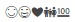
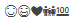
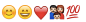
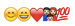

---
# MUST HAVE BEG
layout: post
disqus_identifier: 20150318-hello-emoji # DO NOT CHANGE THE VALUE ONCE SET
title: Hello Emoji, 😊
# MUST HAVE END

is_short: true
subtitle:
tags: 
- emoji
date: 2015-03-18 19:13:00
image:
image_desc:
---

🦄  🤔  😈  

Emoji是unicode的一部分，UTF-8编码也是可以表示Emoji的。
比如😁对应的unicode是`U+1F601`，对应的UTF-8编码是`\xF0\x9F\x98\x81`。所以我们可以在UTF-8编码存储的
文本中（比如HTML文件）保存Emoji表情。

###显示文本中的emoji
我们需要一种字体来显示以UTF-8编码的Emoji表情。通常，一种字体不能显示所有的UTF-8编码。不能显示时，通常
会显示成一个“小方块”。在较新的OS X系统上，`Apple Color Emoji`字体可以显示Emoji表情。在较新的Windows上
（比如Windows 7/8），`Segoe UI Symbol`字体可以显示黑白的Emoji表情。Windows 8上可以用
`Segoe UI Emoji`字体来显示彩色的表情。

###显示网页上的emoji
对于网页元素，我们可以通过CSS属性`font-family`来指定（一系列）字体。比如，

    font-family: Gill Sans Extrabold, sans-serif;

排在前面的字体优先级较后面的高。如果用户电脑上没有安装优先级高的字体，那么根据优先级依次尝试后续的
字体。如果所有的字体都没有找到，那么使用浏览器提供的字体（Initial value depends on user agent）。
在OS X上，如果font-family中没有指定可以显示Emoji的字体，Safari是可以正常显示Emoji的，而Chrome则不能。
这是因为这两个浏览器提供的默认字体有区别。

为了在Windows和OS X上都能显示Emoji表情，可以向font-family里加入`Apple Color Emoji`，`Segoe UI Emoji`，
和`Segoe UI Symbol`字体。比如，

    font-family: Helvetica, arial, freesans, clean, sans-serif, 'Apple Color Emoji', 'Segoe UI Emoji', 'Segoe UI Symbol';

效果如下，

Chrome on Windows 7       

IE 11 on Windows 7      

Safari on OS X     

Chrome on OS X      

### 在OS X下输入emoji
OS X自带的中文输入法可以直接输入表情符号，比如，

<!-- at least one blank line before 
, 
, <pre> or <table>,
and one blank after 
.
but you can use , <cite>, <del> freely -->

  

输入法可以输入的emoji有限（毕竟你不太可能记住所有emoji对应的中文），这时可以通过`表情与符号`来输入emoji。

在`偏好设置`的`键盘`下勾上`在菜单栏中显示“虚拟键盘及表情与符号检视器”`。

<!-- at least one blank line before 
, 
, <pre> or <table>,
and one blank after 
.
but you can use , <cite>, <del> freely -->

  

然后点击菜单栏的输入法图标，点击`显示表情与符号`，

<!-- at least one blank line before 
, 
, <pre> or <table>,
and one blank after 
.
but you can use , <cite>, <del> freely -->

  

现在就可以双击选择表情了，

<!-- at least one blank line before 
, 
, <pre> or <table>,
and one blank after 
.
but you can use , <cite>, <del> freely -->

  

###参考连接
[Emoji Unicode Tables](http://apps.timwhitlock.info/emoji/tables/unicode)     
[Segoe UI Symbol](https://msdn.microsoft.com/en-us/library/windows/apps/jj841126.aspx)     
[font-family MDN](https://developer.mozilla.org/en-US/docs/Web/CSS/font-family)      
[font-family](http://www.w3schools.com/cssref/pr_font_font-family.asp)    
